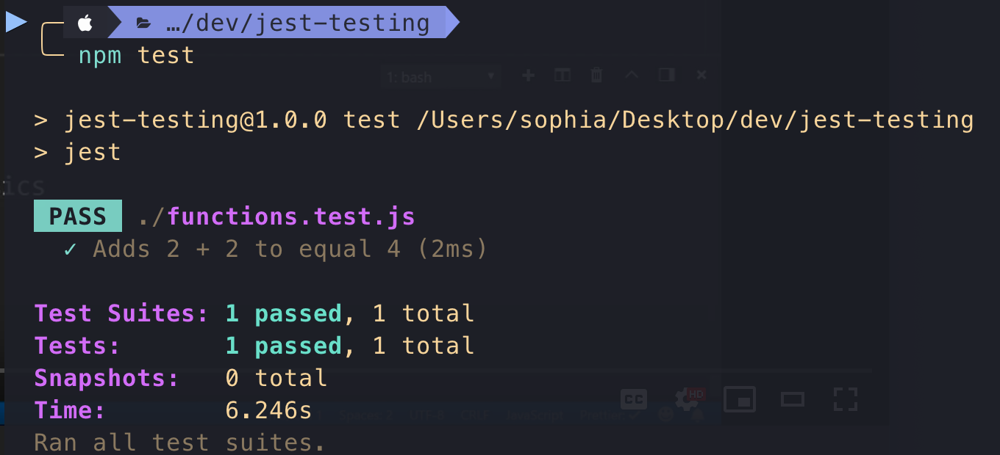

# JavaScript Unit Testing using Jest

[](https://opensource.org/licenses/MIT) [](https://GitHub.com/Naereen/StrapDown.js/graphs/contributors/) [](https://github.com/ellerbrock/open-source-badges/) [](https://saythanks.io/to/kennethreitz)


## A step by step guide

###**Tools**:<br />
- [Visual Studio Code](https://code.visualstudio.com/)<br />
- [Node JS](https://nodejs.org/en/)<br />
- [A guide to unit testing in JS](https://github.com/mawrkus/js-unit-testing-guide/)

###**devDependencies**:<br />
- **jest**

### Commands:

```npm init -y```

```npm i -D jest```

```npm test```

---

``` // functions.js > to check test x PASS ```

```javascript
const functions = {
  add: (num1, num2) => num1 + num2
};

module.exports = functions;

```


``` // functions.js > to check test x FAIL ```

```javascript
const functions = {
  add: (num1, num2) => num1 + num2 + 1
};

module.exports = functions;

```

